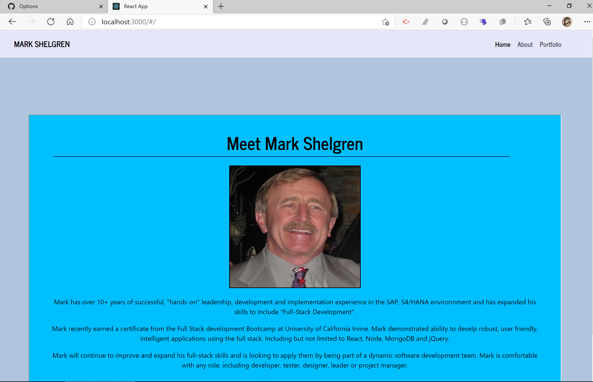

# Unit 20 React Homework: React Portfolio

## Description

Update my Portfolio using React.

## Table of Contents

- [Instructions](#instructions)

- [License](#license)

- [Contributing](#contributing)

- [Usage](#usage)

- [Links](#links)

- [Questions](#questions)

## Instructions

- Open a terminal and run these commands to set up the environment files `npm init`, `npm install`,
  `npm install react-router-dom`, `npm install react`, `npm install react-dom`, `npm install bootstrap`, and `npm install bootstrap-react` to create the node_modules folder and to add additional information to package json.
  - Run `npm start`, this connect you to the PORT 3000 and also open the ReactPortfoli0 Application in the browser.
  - Once the App opens, click on the Navigation links to move from the `Home Page` to the `About` and `Portfolio` pages. THis is a very straight forward app, with no bells or whistles.

## License

This project is licensed under the MIT license.

## Contributing

All contributions are Welcomed!!

## Usage

Users can use the repo, but please do not delete any code.

## Links

- Github Repository:
  [Repository](https://github.com/markshelgren/ReactPortfolio)
- Deployed Application:
  [Github gh-Pages ](https://markshelgren.github.io/ReactPortfolio/)

## Questions

If you have any questions about the repo, open an issue or contact me directly at wpah@comcast.net. You can find more of my work at [Mark Shelgren](https://github.com/markshelgren/ReactPortfolio).

## Screenshots

